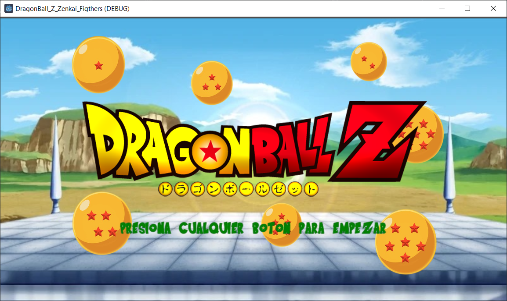
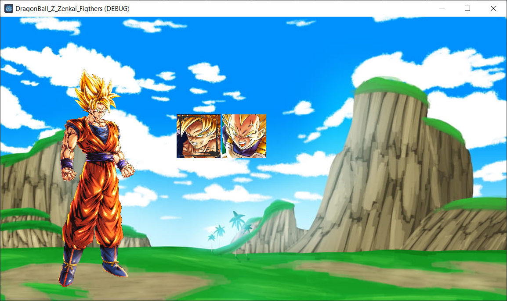
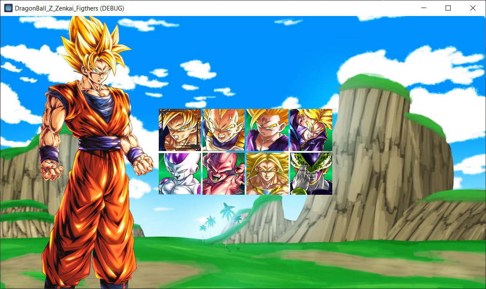
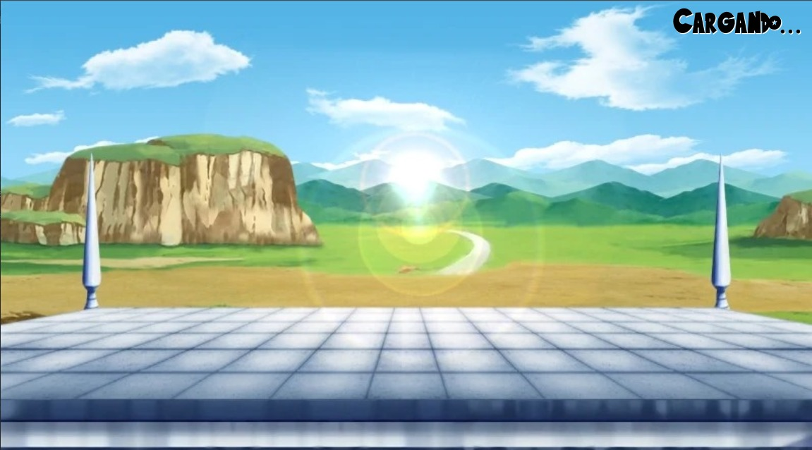
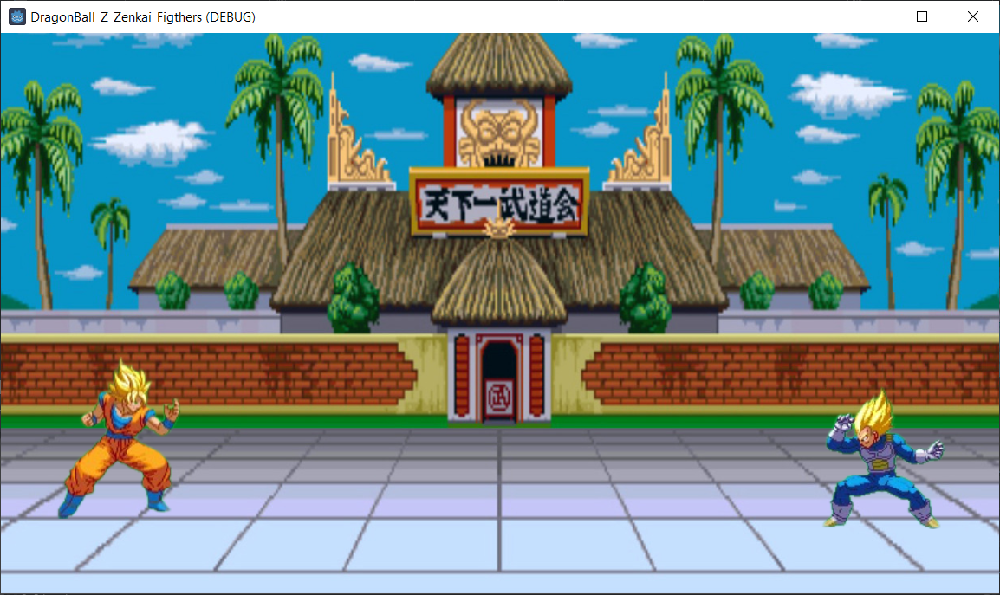

# Proyecto DragonBallZ Zenkai Fighters - Primera Entrega

Este es el repositorio de la primera entrega del proyecto desarrollado en Godot 4.

En esta versión inicial, se incluyen:
- Estructura básica del proyecto.
- Sistema de selección de personajes.
- Interfaz de usuario preliminar.
- Música de fondo con loop.

Próximamente se añadirán más funcionalidades y mejoras.

# Proyecto DragonBallZ Zenkai Fighters - Segunda Entrega 

Segunda entrega de proyecto, adicionando las pantallas de:
- Pantalla de seleccion de personaje (adiccion de todos los personajes y seleccion de estos)
- Pantalla de carga de transición entre pantallas
- Pantalla de juego (Solo adicion de logica de fisicas de izquierda, derecha y salto)

Proximanente se añadira la logica de las hitboxes y poder seleccionar a todos los personajes

##Pantalla de seleccion de personajes

##Pantalla de Carga

##Pantalla de Juego

